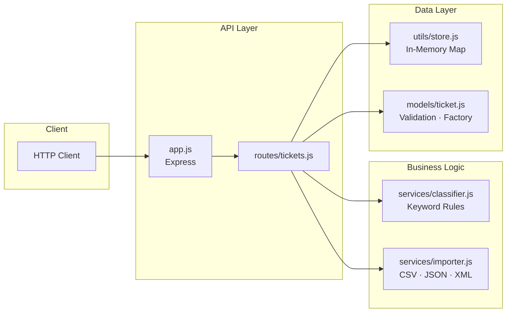
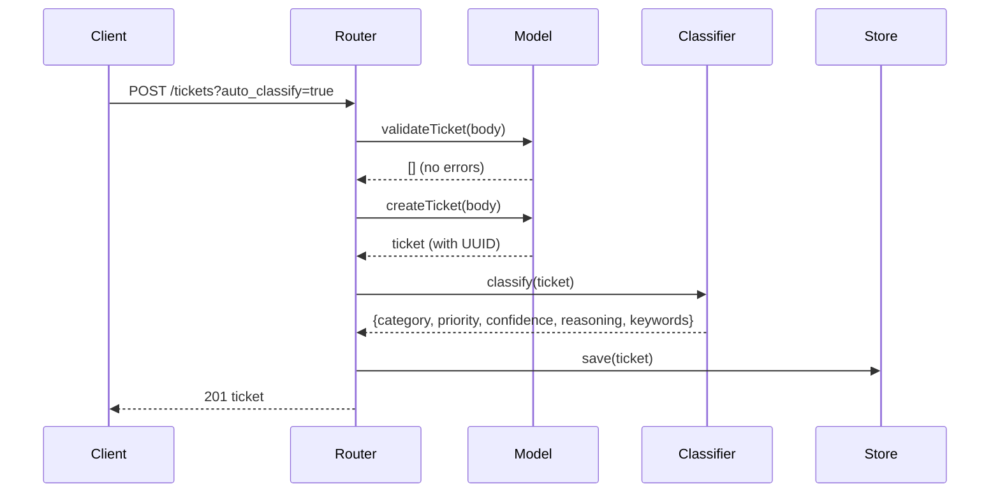
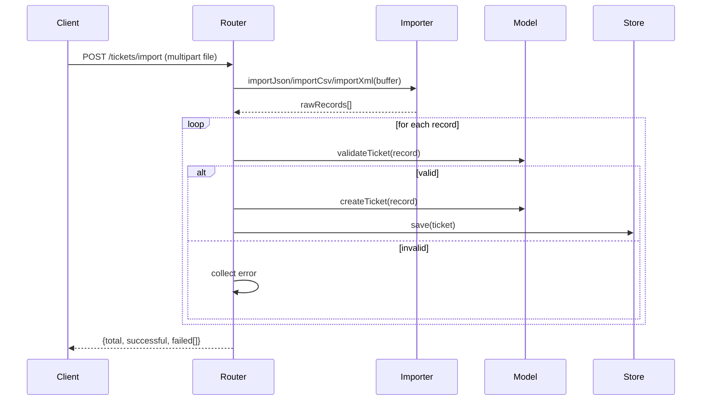

# Architecture

## Component Diagram

## Data Flow — Create & Classify

## Data Flow — Bulk Import

## Component Descriptions

| Component | Responsibility |
|-----------|---------------|
| `app.js` | Mounts router, error handlers; exported for testing |
| `server.js` | Calls `app.listen(3000)` — entry point only |
| `routes/tickets.js` | Handles all 7 endpoints, wires services |
| `models/ticket.js` | Field validation, UUID generation, default values |
| `services/classifier.js` | Priority + category keyword matching, confidence scoring |
| `services/importer.js` | Parses CSV (csv-parse), JSON, XML (xml2js) |
| `utils/store.js` | CRUD over an in-memory `Map`; `resolved_at` auto-set |
| `utils/logger.js` | Thin wrapper over `console` with timestamps |

## Design Decisions

- **In-memory store**: Zero dependencies, trivially replaceable with any DB via the same `store.js` interface.
- **`app.js` vs `server.js` split**: Allows Supertest to require `app` without binding a port.
- **`/tickets/import` route ordering**: Registered before `/:id` in Express to avoid shadowing.
- **Classifier priority**: Rules evaluated in urgency order; first match wins to prevent downgrade.
- **Bulk import fault tolerance**: Per-row errors collected and returned; batch never aborted.

## Security Considerations

- UUIDs generated server-side; client cannot inject IDs.
- All enum fields validated before persistence.
- File uploads limited to 10 MB via Multer.
- Input validated with `validator.js` (email format).
