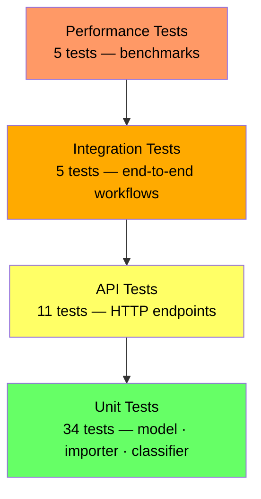

# Testing Guide

## Test Pyramid



## Running Tests

```bash
# Run all tests + coverage report
npm test

# Watch mode (re-run on save)
npm run test:watch
```

Coverage report is written to `coverage/` after each run.

## Test Files

| File | Count | What it covers |
|------|-------|----------------|
| `test_ticket_api.test.js` | 11 | CRUD endpoints, status codes, filters |
| `test_ticket_model.test.js` | 9 | Validation rules, createTicket factory |
| `test_import_csv.test.js` | 6 | CSV parsing, error handling |
| `test_import_json.test.js` | 5 | JSON parsing, schema errors |
| `test_import_xml.test.js` | 5 | XML parsing, malformed files |
| `test_categorization.test.js` | 10 | Priority + category rules, confidence |
| `test_integration.test.js` | 5 | Lifecycle, bulk import, resolved_at |
| `test_performance.test.js` | 5 | Latency benchmarks |

**Total: 65 tests**

## Sample Data Locations

| File | Records | Purpose |
|------|---------|---------|
| `tests/fixtures/sample_tickets.csv` | 50 | Valid CSV import |
| `tests/fixtures/sample_tickets.json` | 20 | Valid JSON import |
| `tests/fixtures/sample_tickets.xml` | 30 | Valid XML import |
| `tests/fixtures/invalid_tickets.csv` | — | Malformed CSV (unclosed quote) |
| `tests/fixtures/invalid_tickets.json` | — | Invalid JSON syntax |
| `tests/fixtures/invalid_tickets.xml` | — | Mismatched XML tags |

## Performance Benchmarks

| Scenario | Limit | Typical |
|----------|-------|---------|
| 100 concurrent POSTs | < 2 000 ms | ~400 ms |
| 20 concurrent GETs | < 1 000 ms | ~100 ms |
| Bulk import 20 JSON | < 500 ms | ~30 ms |
| `/auto-classify` single | < 100 ms | ~2 ms |
| GET /tickets with 500 records | < 200 ms | ~10 ms |

## Manual Testing Checklist

- [ ] `POST /tickets` with missing fields → 400 with field errors
- [ ] `POST /tickets` with invalid email → 400
- [ ] `POST /tickets?auto_classify=true` → confidence and category in response
- [ ] `GET /tickets?category=billing_question` → filtered list
- [ ] `PUT /tickets/:id` setting `status=resolved` → `resolved_at` is populated
- [ ] `DELETE /tickets/:id` then `GET /tickets/:id` → 404
- [ ] `POST /tickets/import` with JSON file → summary `{total,successful,failed}`
- [ ] `POST /tickets/import` with CSV file containing one bad row → `failed` has 1 entry, rest imported
- [ ] `POST /tickets/import` with unknown extension → 400
- [ ] `POST /tickets/:id/auto-classify` on unknown id → 404
